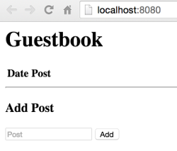

<!-- BEGIN MUNGE: UNVERSIONED_WARNING -->

<!-- BEGIN STRIP_FOR_RELEASE -->


<h2>PLEASE NOTE: This document applies to the HEAD of the source tree</h2>

If you are using a released version of Kubernetes, you should
refer to the docs that go with that version.

<strong>
The latest 1.0.x release of this document can be found
[here](http://releases.k8s.io/release-1.0/examples/porting-steps/containers/README.md).

Documentation for other releases can be found at
[releases.k8s.io](http://releases.k8s.io).
</strong>
--

<!-- END STRIP_FOR_RELEASE -->

<!-- END MUNGE: UNVERSIONED_WARNING -->

# Running the app in containers

You must modify your two-tier app to ensure that the front-end and back-end continue to connect when run from within containers. Ensuring that your app runs in containers is a prerequisite task for running your app in a Kubernetes cluster.

In this task, the version of the two-tier guestbook app that you have running on your local computer is used to demonstrate how to modify your app for running in containers with Docker Engine. Because any given container is built using a single image, you must create separate containers for both the front-end and back-end of your app. To demonstrate this, two container images are created for the example guestbook app:

 * The front-end of the guestbook app (`app.go`) is modified and then built into an image that runs in its own container. Since the guestbook app simply connects to a MySQL server, the only modification that is made to the front-end is for configuring the connection to the back-end container. In addition, a `Dockerfile` is created to define the container build instructions.
 * The back-end MySQL server container is created by building the publicly shared `mysql` image that gets pulled down from the Docker Hub registry.

### Key learning points

In this task, you learn how to:

 * Define your container build instructions in a `Dockerfile`. For details, see [Writing Dockerfiles](http://docs.docker.com/engine/articles/dockerfile_best-practices/).
 * Replace hard-coded connection information with Docker container links and environment variables. For details, see [Legacy container links](https://docs.docker.com/userguide/dockerlinks/).
 * Use hosted images from public registries to build your containers. For details, see [Docker Hub](https://docs.docker.com/docker-hub/).
 * Build and run container images on your local computer with the Docker Engine. For details, see [Install Docker engine](https://docs.docker.com/installation/).

 > **Extended learning**: Containers are highly portable; therefore, containers running on your local computer run the same way as they run in a production environment. [Learn more...](https://www.docker.com/what-docker)

------------

## Before you begin

It is important to understand that the files, images, and individual steps for running the guestbook app in a container might not resemble how your app is configured, structured, or packaged. Depending on the complexity and app dependencies, there might be additional steps for configuring and running your app in containers that are not covered in this tutorial.

>**Extended learning**: Details about all the necessary steps that you need to perform in order for you to run your apps in containers are explained in the Docker documentation, including information about how to:

> * [Create images of your apps](http://docs.docker.com/engine/userguide/dockerimages/#build-your-own-images).
> * [Store and use images from Docker Hub](http://docs.docker.com/engine/userguide/dockerrepos/), including pushing your images to a registry and pulling down public images.
> * [Configure networking and discovery](http://docs.docker.com/engine/userguide/networkingcontainers/) to support running your containers across separate hosts.

> *Tip*: For private image storage, see [Google Container Registry](https://cloud.google.com/container-registry/).

If you want to save a version of your app that runs locally on your computer, you should make a copy. Otherwise, the changes that you make in the steps below will modify the app so that it runs only in containers.

------------

## Prerequisites

You must meet the following prerequisites to run your app in containers with the Docker Engine:

 * To port your app into containers, you must:

     * Download and install the Docker Engine. For details, see [Install Docker Engine](https://docs.docker.com/installation/).

     * Understand how to work with Docker containers by running Docker Engine commands. For more information about the commands used in this task, see the following reference topics:
         * [`Docker build`](https://docs.docker.com/engine/reference/commandline/build/)
         * [`Docker run`](https://docs.docker.com/engine/reference/commandline/run/)
         * [`Docker rm`](https://docs.docker.com/engine/reference/commandline/rm/)

 * To follow along step-by-step with porting the example guestbook app into Docker containers, you must have a copy of the locally installed version of the app:

    * If you performed the optional task of [locally installing the guestbook app](../local/README.md), you can continue with the steps below and manually update the files that you have installed.

    * To start following along now, you can download a copy of the example guestbook files.

        Download the following source files of the locally installed version of the guestbook app to an installation directory from where you will modify the files and then create and run a container:

        * [`app.go`](../local/app.go)
        * [`main.html`](../local/main.html)

------------

## To run the app in containers:

 1. Create a container named `mysql-cont` with the MySQL image (`mysql`) by running the following command from your terminal window:

    ```shell
    $ docker run --name mysql-cont -e MYSQL_ROOT_PASSWORD=mysecretpassword -d mysql
    ```

    The Docker Engine finds and pulls down the `mysql` image and then builds and runs the image in a container named `mysql-cont`. The MySQL server is now running on your computer with the `mysecretpassword` password that is accessible as the `MYSQL_ROOT_PASSWORD` environment variable. For more information about the `mysql` image, see the [mysql](https://hub.docker.com/r/library/mysql/) repository.

    > **Extended learning**: The MySQL server that you started in this step is not configured for reuse and will be deleted when the container is stopped. In the next task when the containerized app is ported into Kubernetes, the example guestbook app is configured to use persistent disk storage in Google Compute Engine. For more information about storage, including how to use a *data volume* in your containers for persistent data, see the [data volume](https://docs.docker.com/userguide/dockervolumes/) topic.

 1. Modify the front-end of the guestbook app (`app.go`) so that it uses environment variables for connecting to the `mysql-cont` container that you just created:

    > *Tip*: You can skip this step and instead download the following pre-configured copy of the file that already includes the modifications listed below and is ready to build into a container: [Download `app.go`](app.go).

    1. Add `os` to the `import` statement of the `app.go` file so that the guestbook app imports environment variables:

        Example:

        ```go
        ...
        import (
            "database/sql"
            "fmt"
            "html/template"
            "log"
            "net/http"
            "os"
            "time"

            _ "github.com/go-sql-driver/mysql"
        )
        ...
         ```
 
    1. Replace the following hard-coded connection information in the `app.go` file with the `DB_PW` and `mysql-hostname` environment variables:

        ```go
        func connect() (*sql.DB, error) {
        db, err := sql.Open("mysql", "root:secret@tcp(localhost:3306)/?parseTime=true")
        if err != nil {
            return db, fmt.Errorf("Error opening db: %v", err)
        }
        ```

        1. In the following line, remove the hard-coded MySQL server connection information and replace it with the `connect` variable:

            `db, err := sql.Open("mysql", `~~`"root:secret@tcp(localhost:3306)/?parseTime=true"`~~`)`

            Result:

            `db, err := sql.Open("mysql", connect)`

        1. Insert the following lines to use the `DB_PW` and `mysql-hostname` environment variables:

            ```go
            dbpw := os.Getenv("DB_PW")
            connect := fmt.Sprintf("root:%v@tcp(mysql-hostname:3306)/?parseTime=true", dbpw)
            ```

        Result:

        ```go
        ...
        func connect() (*sql.DB, error) {
            dbpw := os.Getenv("DB_PW")
            connect := fmt.Sprintf("root:%v@tcp(mysql-hostname:3306)/?parseTime=true", dbpw)
            db, err := sql.Open("mysql", connect)
            if err != nil {
               return db, fmt.Errorf("Error opening db: %v", err)
            }
        ...
        ```

    The front-end of the guestbook app is now configured to use environment variables to connect to the `mysql-cont` container.

 1. In the root directory of the guestbook app, create a `Dockerfile` file for the front-end container with the following contents:

    > *Tip*: You can skip this step and instead download the following pre-configured copy of the file that is ready to use for the container build: [Download `Dockerfile`](Dockerfile).

    ```dockerfile
    FROM golang:1.4-onbuild
    EXPOSE 8080
    ```

    The `onbuild` variable is included in the build instructions so that when the front-end container image is built, it automatically pulls in the latest Go source.

 1. Build and run the front-end container of the guestbook app by running the following commands from your terminal window:

    ```shell
    $ docker build -t twotier .
    $ docker run -d --link mysql-cont:mysql-hostname -p 8080:8080 -e DB_PW=mysecretpassword twotier
    ```

    A container named `twotier` is created and then run with commands to create the Docker container link (`--link mysql-cont:mysql-hostname`) and the environment variable for your MySQL server password (`-e DB_PW=mysecretpassword`).

    > **Extended learning**: You can run multiple front-end containers to scale up your app by defining individual ports for each container and then configuring load balancing. At this point, scaling up containers is a manual process but this is simplified in the next task when the containerized app is ported into Kubernetes.

 1. View the guestbook app by opening your web browser to [http://localhost:8080](http://localhost:8080).

     

 1. Stop running the guestbook app by running the following commands from the terminal window:

    1. Run the following command to list all the containers that are currently running:

        `$ docker ps`

        Example:

        ```shell
        $ docker ps
        CONTAINER ID  IMAGE    COMMAND                 CREATED         STATUS         PORTS                   NAMES
        91141f1b99ea  twotier  "go-wrapper run"        3 seconds ago   Up 1 seconds   0.0.0.0:8080->8080/tcp  prickly_galileo
        90698971e038  mysql    "/entrypoint.sh mysql"  24 seconds ago  Up 22 seconds  3306/tcp                mysql-cont
        ```

    1. Stop the front-end container by running the following command with either the container name or container ID that corresponds to the `twotier` image:

        `$ docker rm -f` *`<container_name_or_id>`*

        For example, you can run either one of the following commands:

         * `$ docker rm -f 91141f1b99ea`
         * `$ docker rm -f prickly_galileo`

    1. Stop the back-end container by running the following command with the container name `mysql-cont` and the `-v` parameter:

        `$ docker rm -vf mysql-cont`

        The container named `mysql-cont` is removed along with its associated volume (`-v`) and all data in the volume (database) is lost.

    Both of the containers of the guestbook app have been stopped. You can verify by running the `docker ps` command again.

------------

## Summary

In this task, you ported a two-tier app into containers by creating a new image for the front-end and building the back-end with a public image. Continue to the next task to learn how to port these containers into Kubernetes so that you can run them in a cluster.

------------

#### Previous: [Install and run the app locally](../local/README.md)

#### Next:  [Run your containerized apps in a Kubernetes cluster](../k8s/README.md)

<!-- BEGIN MUNGE: GENERATED_ANALYTICS -->
[]()
<!-- END MUNGE: GENERATED_ANALYTICS -->
