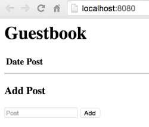

<!-- BEGIN MUNGE: UNVERSIONED_WARNING -->

<!-- BEGIN STRIP_FOR_RELEASE -->


<h2>PLEASE NOTE: This document applies to the HEAD of the source tree</h2>

If you are using a released version of Kubernetes, you should
refer to the docs that go with that version.

<strong>
The latest 1.0.x release of this document can be found
[here](http://releases.k8s.io/release-1.0/examples/porting-steps/local/README.md).

Documentation for other releases can be found at
[releases.k8s.io](http://releases.k8s.io).
</strong>
--

<!-- END STRIP_FOR_RELEASE -->

<!-- END MUNGE: UNVERSIONED_WARNING -->

# Installing and running the app locally

Install and run this local version of the example guestbook application to provide yourself a starting point for learning how to port a simple two-tier app into Kubernetes. After you install and run a MySQL server (back-end), you build and run the guestbook (front-end) so that you can access the web interface in your browser.

This is an optional task of the [Tutorial: Porting apps into containers and running them in Kubernetes clusters](../README.md). If you want to follow along step-by-step through the whole process, you can start here and install the example guestbook app locally.

Alternatively, you can skip this task and move on to learning how to port your app into containers, especially if you want to run that app in Kubernetes. To move on to the next task in this tutorial, see [Running the app in containers](../containers/README.md).

------------

## Prerequisites

You must meet the following prerequisites to run the example guestbook app locally:

 * Download and install the MySQL server. For details, see the [MySQL downloads](http://dev.mysql.com/downloads/) page.
 * Install and configure the Go build environment. For details, see the [Getting Started](http://golang.org/doc/install) topic.

------------

## To install and run the app on your local computer:

 1. Ensure that your MySQL server is running. For example, you can run the following commands to display all user information:

    ```shell
    $ mysql -u root
    mysql> SELECT User, Host, Password FROM mysql.user;
    mysql> QUIT
    ```

    You logged into the MySQL server as the root user, displayed all user information, and then logged out.

 1. Download the following guestbook app files to the directory where you want the app installed:

    * [`app.go`](app.go)
    * [`main.html`](main.html)

 1. Set the user credentials in the `app.go` file to connect to the MySQL server. The guestbook app (`app.go`) is pre-configured to connect to the server using the root user and `mysecretpassword` password.

    You must either change the root user password on the MySQL server or modify the guestbook app to set a valid MySQL server user name and password:

    * To update your MySQL server so that the password for the root user is `mysecretpassword`, run the following commands:

        ```shell
        $ mysql -u root
        mysql> SET PASSWORD FOR 'root'@'localhost' = PASSWORD('mysecretpassword');
        mysql> QUIT
        ```

        You logged into the MySQL server as the root user, changed the server password for the root user to `mysecretpassword`, and then logged out.

    * To modify the app and set a user name and password that can connect to your MySQL server, edit the following line in the `app.go` file:

        ```
        root:mysecretpassword@tcp(localhost:3306)
        ```

        Example: To specify user 'exampleuser' and password 'examplepass', you edit the line to:

        ```
        exampleuser:examplepass@tcp(localhost:3306)
        ```

 1. Build and run the guestbook app by running the following commands from the terminal window:

    1. Ensure that your Go build environment is configured and includes the `Go-MySQL-Driver` package by running the following command:

        ```shell
        $ go get github.com/go-sql-driver/mysql
        ```

        The package dependency is installed into your Go workspace.

    1. Run the following command to build and then run the guestbook app:

        ```shell
        $ go build
        $ ./local
        ```

        The app is built, starts running, creates and connects to a MySQL database, and then you receive the "*Database connected and setup*" message.

 1. View the guestbook app by opening your web browser to [localhost:8080](http://localhost:8080).

    

    > *Tip*: To stop the guestbook app, use the keyboard combination **`Ctrl + C`** in the same terminal window where you started the app.

------------

## Summary

In this task, you installed and configured a simple two-tier app on your local machine and can now follow along step-by-step with the remainder of the tutorial. Continue to the next task to learn how to port the app into containers and then run those containers on your local machine with the Docker Engine.

------------

#### Previous: [Tutorial: Porting apps into containers and running them in Kubernetes clusters](../README.md)

#### Next: [Run apps in containers](../containers/README.md)

<!-- BEGIN MUNGE: GENERATED_ANALYTICS -->
[]()
<!-- END MUNGE: GENERATED_ANALYTICS -->
