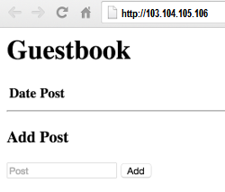

<!-- BEGIN MUNGE: UNVERSIONED_WARNING -->

<!-- BEGIN STRIP_FOR_RELEASE -->


<h2>PLEASE NOTE: This document applies to the HEAD of the source tree</h2>

If you are using a released version of Kubernetes, you should
refer to the docs that go with that version.

<strong>
The latest 1.0.x release of this document can be found
[here](http://releases.k8s.io/release-1.0/examples/porting-steps/secret/README.md).

Documentation for other releases can be found at
[releases.k8s.io](http://releases.k8s.io).
</strong>
--

<!-- END STRIP_FOR_RELEASE -->

<!-- END MUNGE: UNVERSIONED_WARNING -->

# Extended learning: Using secrets for your passwords

You use Kubernetes secrets as an alternative to environment variables so that your sensitive data in your cluster is more secure and manageable.

In this optional task, the version of the example guestbook app that you have running in your Kubernetes cluster is used to demonstrate how to modify your app to use a Kubernetes secret rather than an environment variable. For more information about secrets, including other examples, see the [Secrets](../../docs/user-guide/secrets.md) topic.

To use a secret, you must define and create the secret itself and then update each pod in your cluster for which you want using that secret. For the guestbook app, the environment variables that you created in the previous task for the MySQL password are removed and replaced with a secret. Therefore, the following modifications and new files must be added to the app:

 * Create a new configuration file to define the secret.
 * Modify both of the existing configuration files for the front-end and back-end containers so that the environment variables for the MySQL password are replaced with the new secret.
 * Create a custom `Dockerfile` file to build a version of the MySQL container that can read from a mounted file.

After modifying the app, you build both containers, push them to the registry, and then deploy them to your cluster.

### Key learning points

 * How to replace environment variables with Kubernetes secrets.
 * How to create and use a custom `Dockerfile` with a container image from a registry.

------------

## Before you begin

To provide an optional method for completing this tutorial, the Kubernetes configuration files that are used in these steps are pre-configured to use pre-built container images of the guestbook app. The container images include all the modifications described in the steps below and have already been built and pushed to Google Container Registry at `gcr.io/google-samples/steps-twotier:secret` and `gcr.io/google-samples/mysql:secret`. This is further explained below in [Step 1](#to-create-and-use-secrets).

If you want to save a version of your app that uses environment variables for your MySQL password, you should make a copy. Otherwise, the changes that you make in the steps below will modify the app so that it instead uses Kubernetes secrets for your MySQL password.

------------

## Prerequisites

You must meet the following prerequisites to modify your app so that it uses Kubernetes secrets:

 * To modify your app so that it uses Kubernetes secrets, you must:

     * Download and install the Docker Engine. For details, see [Install Docker Engine](https://docs.docker.com/installation/).

     * Create an account in a registry where you can push your container images. An account in either [Docker Hub](https://hub.docker.com/), [Google Container Registry](https://cloud.google.com/tools/container-registry/), or another private registry is supported.

     * Understand the roles of a Kubernetes secret in your cluster. For more information, see [Secrets](../../docs/user-guide/secrets.md).

     * Install Kubernetes and then create a cluster. For details, see [Creating a Kubernetes Cluster](../../docs/getting-started-guides/README.md).

     * Install and configure the kubectl CLI. For details, see [Installing kubectl](../../docs/user-guide/prereqs.md).

 * To follow along step-by-step with modifying the example guestbook app so that it uses secrets in a Kubernetes cluster on Google Cloud Platform, you must:

    * Have a copy of the example guestbook app that can be deployed to a Kubernetes cluster:

        * If you performed the task of [running the containerized app in a Kubernetes cluster](../k8s/README.md), you can continue with the steps below and manually update the files that you have installed.

        * To start following along now, you can download a copy of the files.

            Download the following source files of the example guestbook app to an installation directory from where you will modify the files and then build new containers:

            * [`app.go`](../k8s/app.go)
            * [`mysql.yaml`](../k8s/mysql.yaml)
            * [`Dockerfile`](../k8s/Dockerfile)
            * [`twotier.yaml`](../k8s/twotier.yaml)
            * [`main.html`](../k8s/main.html)

    * Create a Google Compute Engine project on Google Cloud Platform. For a free trial, see [Try Google Cloud Platform](https://cloud.google.com/free-trial/).

    * Install and configure the Google Cloud SDK. For details, see [Installation and Quick Start](https://cloud.google.com/sdk/#Quick_Start).

    * Deploy your Kubernetes cluster to a VM in Google Compute Engine. For details, see [Creating a Kubernetes Cluster](../../docs/getting-started-guides/gce.md).

    * Configure your project in Google Compute Engine so that port 80 is open and it has a 200 GB physical disk that can be used for persistent disk storage. See the steps in the previous task ([Running the containerized app in a Kubernetes cluster](../k8s/README.md)) for details about how to create the `k8s-80` firewall rule and `mysql-db` physical disk.

------------

## To create and use secrets:

 1. Modify the front-end of the guestbook app (`app.go`), create a custom `Dockerfile` for the back-end, and then build and push the container images to a registry:

    > **Note**: If you are following along step-by-step with the guestbook example, you have the option to skip to the next step and begin creating and modifying your Kubernetes configuration files. However, you should review each of the following steps to learn and understand the process of modifying your app to use Kubernetes secrets. The configuration files in the next step are pre-configured to use the images that have already been built and push to Google Container Registry at `gcr.io/google-samples/steps-twotier:secret` and `gcr.io/google-samples/mysql:secret`.

    1. Modify the following lines in the `app.go` file so that it can read the MySQL password from a mounted file:

        ```go
        ...
        func connect() (*sql.DB, error) {
            dbpw := os.Getenv("DB_PW")
            mysqlHost := os.Getenv("MYSQL_SERVICE_HOST")
            mysqlPort := os.Getenv("MYSQL_SERVICE_PORT")
            connect := fmt.Sprintf("root:%v@tcp(%v:%v)/?parseTime=true", dbpw, mysqlHost, mysqlPort)
            db, err := sql.Open("mysql", connect)
            if err != nil {
                return db, fmt.Errorf("Error opening db: %v", err)
            }
        ...
        ```

        > *Tip*: You can skip this step and instead download the following pre-configured copy of the file that already includes the modifications listed in this step: [Download `app.go`](app.go).

        1. Add `io/ioutil` to the `import` statement of the `app.go` file so that the guestbook app can read from a file:

            Example:

            ```go
            ...
            import (
                "database/sql"
                "fmt"
                "html/template"
                "io/ioutil"
                "log"
                "net/http"
                "os"
                "time"

                _ "github.com/go-sql-driver/mysql"
            )
            ...
             ```

        1. In the following line, replace the `DB_PW` environment variable with code to read the password from a mounted file:

            `dbpw := `~~`os.Getenv("DB_PW")`~~

            Example:

            ```go
            dbpw, err := ioutil.ReadFile("/etc/mysql-password/password")
            if err != nil {
                return nil, fmt.Errorf("Error reading db password: %v", err)
            }
            ```

        1. In the following line, cast the `dbpw` variable to a string by revising `dbpw` to `string(dbpw)`:

            `connect := fmt.Sprintf("root:%v@tcp(%v:%v)/?parseTime=true", `~~`dbpw`~~`, mysqlHost, mysqlPort)`

            Example:

            `connect := fmt.Sprintf("root:%v@tcp(%v:%v)/?parseTime=true", string(dbpw), mysqlHost, mysqlPort)`

        Result:

        ```go
        ...
        func connect() (*sql.DB, error) {
            dbpw, err := ioutil.ReadFile("/etc/mysql-password/password")
            if err != nil {
               return nil, fmt.Errorf("Error reading db password: %v", err)
            }
            mysqlHost := os.Getenv("MYSQL_SERVICE_HOST")
            mysqlPort := os.Getenv("MYSQL_SERVICE_PORT")
            connect := fmt.Sprintf("root:%v@tcp(%v:%v)/?parseTime=true", string(dbpw), mysqlHost, mysqlPort)
            db, err := sql.Open("mysql", connect)
            if err != nil {
                return db, fmt.Errorf("Error opening db: %v", err)
            }
        ...
        ```

    1. Create a new `Dockerfile` in a sub-directory named `mysql`:

        > *Tip*: You can skip this step and instead download the following pre-configured copy of the file that already includes the build instructions listed in this step: [Download `Dockerfile`](secret/mysql/Dockerfile).

        To customize the public `mysql` container image from Docker Hub so that it can read the MySQL password from a file, you must create a new `Dockerfile` that contains the following details:

        ```
        FROM mysql:latest
        CMD export MYSQL_ROOT_PASSWORD=$(cat /etc/mysql-password/password); /entrypoint.sh mysqld
        ```

        With a custom `Dockerfile`, you can build yourself a custom version of the public `mysql` container image. In the build instructions, the password `MYSQL_ROOT_PASSWORD` variable is specified with the `CMD` line so that it gets evaluated at runtime. For information about the original `Dockerfile` in the public `mysql` image, see the [`mysql` Github repository](https://github.com/docker-library/mysql/blob/master/5.6/Dockerfile).

    1. Build new container images that include your modifications and then push those images to the registry:

        > **Remember**: You can skip this step and continue following along step-by-step by using the pre-configured guestbook app images that have already been pushed to Google Container Registry at: `gcr.io/google-samples/steps-twotier:secret` and `gcr.io/google-samples/mysql:secret`.

        The commands for building and pushing the images to your registry are the same commands that you ran when you ported your containers into your Kubernetes cluster. For more information, refer to previous steps about building and pushing images in the [Running the containerized app in a Kubernetes cluster](../k8s/README.md#to-run-the-containerized-app-in-a-cluster) task. You can use the following Google Container Registry and Docker Hub examples for guidance.

        **Examples**: The following examples show what commands you use to push both the front-end and back-end container images of your app to a registry.  In these examples, `twotier:secret` and `mysql:secret` specify both the name and tag for the images. Both `twotier` and `mysql` specify the repositories in your registry where you want to push the images:

        * Google Container Registry examples:

            ```shell
            $ docker build -t gcr.io/<project-id>/twotier:secret .
            $ gcloud docker push gcr.io/<project-id>/twotier
            $ cd mysql
            $ docker build -t gcr.io/<project-id>/mysql:secret .
            $ gcloud docker push gcr.io/<project-id>/mysql
            $ cd ..
            ```

        * Docker Hub examples:

            ```shell
            $ docker build -t <account-name>/twotier:secret .
            $ docker push <account-name>/twotier
            $ cd mysql
            $ docker build -t <account-name>/mysql:secret .
            $ docker push <account-name>/mysql
            $ cd ..
            ```

 1. Create the `password.yaml` configuration file for the `mysql-pw` secret and then modify the existing configuration files for the front-end and back-end (`twotier.yaml` and `mysql.yaml`) to  instead use the `mysql-pw` secret:

    1. Create a new a file named `password.yaml` in the root directory with the following details:

        > *Tip*: You can skip this step and instead download the following pre-configured copy of the file that already includes the secret definition: [Download `password.yaml`](secret/password.yaml).

        ```yaml
        apiVersion: "v1"
        kind: "Secret"
        metadata:
          name: "mysql-pw"
        data:
          password: "bXlzZWNyZXRwYXNzd29yZA=="
        ```
        > **Note**: To set your own password in the secret, you can encode it to base64 by running `echo -n `*`mypassword`*` | base64` from your terminal window.

    1. In the `twotier.yaml` configuration file, modify the following lines to specify the new `twotier` container image, remove the `DB_PW` environment variable, and mount the `mysql-pw` secret as a volume:

        ```yaml
        ...
              spec:
                containers:
                - name: "twotier"
                  env:
                  - name: DB_PW
                    value: mysecretpassword
                  image: "gcr.io/google-samples/steps-twotier:k8s"
                  ports:
                  - name: "http-server"
                    hostPort: 80
                    containerPort: 8080
                    protocol: "TCP"
        ---
        ...
        ```

        > *Tip*: You can skip this step and instead download the following pre-configured copy of the file that already includes the modifications listed in this step: [Download `twotier.yaml`](twotier.yaml).

        1. Specify the new front-end container image that you just pushed to your registry:

            `image: "gcr.io/google-samples/steps-twotier:`~~`k8s"`~~

            Example:

            `image: "gcr.io/google-samples/steps-twotier:secret"`

            > **Remember**: The details above specify the pre-built image that exists in Google Container Registry. If you pushed your image to a different project or container registry, you must edit the `image:` line, for example: `image: "`*`<container-registry-details>`*`/twotier"`.

        1. Remove the following lines to remove the `DB_PW` environment variable:

            ~~`env:`~~<br/>
            ~~`- name: DB_PW`~~<br/>
            ~~` value: mysecretpassword`~~<br/>

        1. Insert the definition for mounting the `mysql-pw` secret as a volume:

            1. Under `spec:` > `volumes:`, add the following lines:

                ```yaml
                - name: "password"
                  secret:
                    secretName: "mysql-pw"
                ```

            1. Under `spec:` > `containers:` > `volumeMounts:`, add the following lines:

                ```yaml
                - name: "password"
                mountPath: "/etc/mysql-password"
                readOnly: true
                ```

        Result:

        ```yaml
        ...
              spec:
                volumes:
                - name: "password"
                  secret:
                    secretName: "mysql-pw"
                containers:
                - name: "twotier"
                  image: "gcr.io/google-samples/steps-twotier:secret"
                  ports:
                  - name: "http-server"
                    hostPort: 80
                    containerPort: 8080
                    protocol: "TCP"
                  volumeMounts:
                  - name: "password"
                    mountPath: "/etc/mysql-password"
                    readOnly: true
        ---
        ...
        ```

    1. In the `mysql.yaml` configuration file, modify the following lines to specify the new container image, remove the `MYSQL_ROOT_PASSWORD` environment variable, and mount the `mysql-pw` secret as a volume:

        ```yaml
        ...
          spec:
            volumes:
            - name: "mysql-vol"
              gcePersistentDisk:
                pdName: "mysql-disk"
                fsType: "ext4"
            containers:
            - name: "mysql"
              image: "mysql:latest"
              env:
              - name: MYSQL_ROOT_PASSWORD
                value: mysecretpassword
              ports:
              - name: "mysql"
                containerPort: 3306
                protocol: "TCP"
              volumeMounts:
              - name: "mysql-vol"
                mountPath: "/var/lib/mysql"
        ---
        ...
        ```

        > *Tip*: You can skip this step and instead download the following pre-configured copy of the file that already includes the modifications listed in this step: [Download `mysql.yaml`](mysql.yaml).

        1. Specify the new back-end container image that you just pushed to your registry:

            `image: `~~`"mysql:latest"`~~

            Example:

            `image: "gcr.io/google-samples/steps-mysql:secret"`

            > **Remember**: The details above specify the pre-built image that exists in Google Container Registry. If you pushed your image to a different project or container registry, you must edit the `image:` line, for example: `image: "`*`<container-registry-details>`*`/mysql"`.

        1. Remove the following lines to remove the `MYSQL_ROOT_PASSWORD` environment variable:

            ~~`env:`~~<br/>
            ~~`- name: MYSQL_ROOT_PASSWORD`~~<br/>
            ~~` value: mysecretpassword`~~<br/>

        1. Insert the definition for mounting the `mysql-pw` secret as a volume:

            1. Under `spec:` > `volumes:`, add the following lines:

                ```yaml
                - name: "password"
                  secret:
                    secretName: "mysql-pw"
                ```

            1. Under `spec:` > `containers:` > `volumeMounts:`, add the following lines:

                ```yaml
                - name: "password"
                mountPath: "/etc/mysql-password"
                readOnly: true
                ```

        Result:

        ```yaml
        ...
          spec:
            volumes:
            - name: "mysql-vol"
              gcePersistentDisk:
                pdName: "mysql-disk"
                fsType: "ext4"
            - name: "password"
              secret:
                secretName: "mysql-pw"
            containers:
            - name: "mysql"
              image: "gcr.io/google-samples/mysql:secret"
              ports:
              - name: "mysql"
                containerPort: 3306
                protocol: "TCP"
              volumeMounts:
              - name: "mysql-vol"
                mountPath: "/var/lib/mysql"
              - name: "password"
                mountPath: "/etc/mysql-password"
                readOnly: true
        ---
        ...
        ```

    You created and modfied your Kubernetes configuration files to use a Kubernetes secret for your MySQL password.

 1. Ensure that your project is configured in Google Compute Engine and that both the firewall rule `k8s-80` and physical disk `mysql-disk` exist:

    1. Check if firewall rule `k8s-80` exists by running the following command from your terminal window:

       `$ gcloud compute firewall-rules list`

    1. Check if the physical disk `mysql-disk` exists by running the following command from your terminal window:

       `$ gcloud compute disks list`

    If either the firewall rule `k8s-80` or physical disk `mysql-disk` is not listed when you run the above commands, refer to the corresponding steps in the previous task ([Running the containerized app in a Kubernetes cluster](../k8s/README.md#to-run-the-containerized-app-in-a-cluster)).

 1. Ensure that the previous version of your app is not running in your cluster by running the following command to list the current resources in your cluster:

       ```shell
       $ kubectl get rc,pod,svc
       ```

       If there are resources named `twotier` or `mysql` running, you will receive errors when you try to deploy the updated version of your app because it uses the same resource names.

       To stop the previous version of your app and the related resources, refer to the corresponding steps in the previous task ([Running the containerized app in a Kubernetes cluster](../k8s/README.md#to-run-the-containerized-app-in-a-cluster)).

 1. Deploy your new containers to your Kubernetes cluster by running the following commands from your terminal window:

    ```shell
    $ kubectl create -f ./password.yaml
    $ kubectl create -f ./mysql.yaml
    $ kubectl create -f ./twotier.yaml
    ```

    Kubernetes creates the corresponding replication controllers, pods, and services based on your configuration files and runs your app in your cluster.

 1. View the guestbook app in your web browser:

    1. Retrieve the external IP address of the service by running the following `kubectl` command from the terminal window:

        ```shell
        $ kubectl describe service twotier
        ```

    1. Locate the value that is listed for `LoadBalancer Ingress` and then open your web browser to that IP address: `http://`*`<loadbalancer_ingress_ip_adddress>`*.

        Example: `http://103.104.105.106`

        

------------

## Summary

In this task, you upgraded the two-tier app that you have running in a Kubernetes cluster to use secrets. From here, the next step is to learn how to administer your apps and clusters in Kubernetes.

------------

#### Previous: [Run your containerized apps in a Kubernetes cluster](../k8s/README.md)

***Next steps***: Learn about administering your applications and clusters in Kubernetes:

 * [User Guide: Managing Applications](../../../docs/user-guide/README.md)
 * [Cluster Admin Guide](../../../docs/admin/introduction.md)

<!-- BEGIN MUNGE: GENERATED_ANALYTICS -->
[]()
<!-- END MUNGE: GENERATED_ANALYTICS -->
